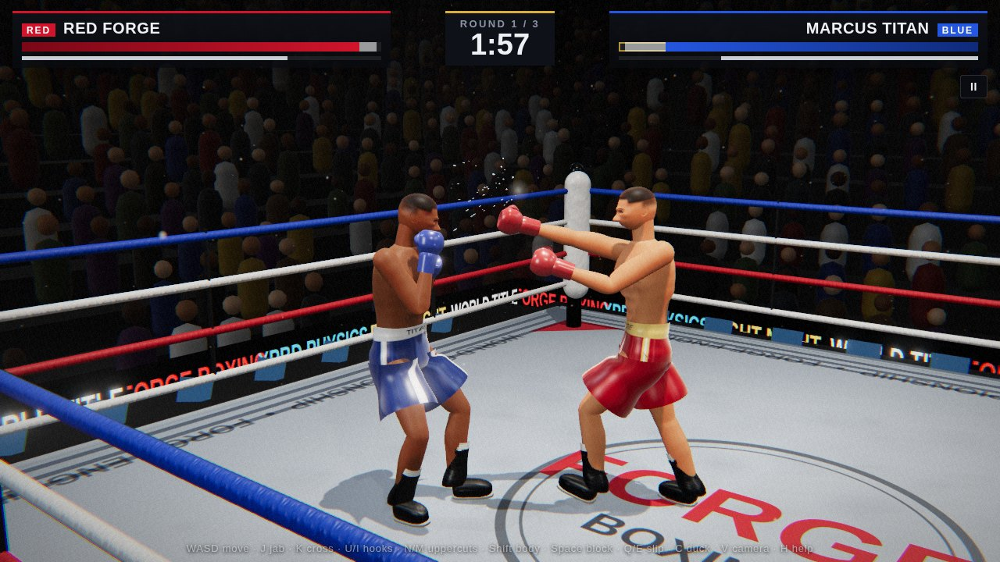
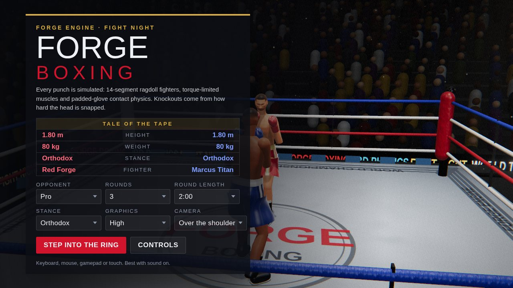
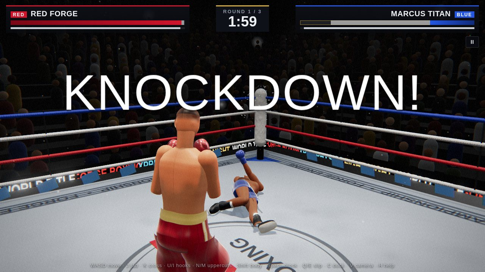

# Forge Boxing

A physics-based boxing game. Nothing in a fight is animated: both fighters are
14-segment active ragdolls whose muscles (torque-limited joint drives) have to
move real mass, so punch speed, reach, power, blocks, knockdowns and the way a
body falls all come out of the simulation.



| Title screen | Knockdown |
| --- | --- |
|  |  |

## Play

```bash
cd games/boxing
npm install
npm run dev          # http://127.0.0.1:5173
```

Other scripts:

| Command | What it does |
| --- | --- |
| `npm run build` | Production build into `dist/` (game + physics lab) |
| `npm run build:single` | One self-contained `dist-single/index.html` (open it straight from disk) |
| `npm test` | Physics validation suite (Node's built-in test runner) |

### Controls

| Action | Keyboard / mouse | Gamepad |
| --- | --- | --- |
| Move | W A S D | Left stick |
| Jab / Cross | J / K, left / right mouse | X / Y |
| Lead / Rear hook | U / I, middle mouse | A / B |
| Lead / Rear uppercut | N / M | RB + X / Y |
| Body shot | Hold Shift with any punch | Hold RT |
| Block (high guard) | Hold Space | LT |
| Slip left / right | Q / E | Right stick left / right |
| Duck / Lean back | C / Z | Right stick down / up |
| Camera · Pause · Replay | V · P or Esc · R | Back · Start |
| Get up after a knockdown | Tap Space or any button fast | Any button |

On phones and tablets an on-screen stick and punch pad appear.

**How to win:** fight at arm's length (about 1 m between you). The jab reaches
furthest; power punches need you to be a step closer, and a punch thrown out of
range steps in automatically but lands softer. Hooks rotate the head the most,
and head rotation is what knocks people down. Body shots drain stamina and
recovery; a hard one on the liver (the opponent's right side) can fold them a
moment later. Blocking absorbs shots on your gloves and arms, for real, but
costs stamina. Tired fighters punch slower and their hands drop.

## How it works

```
src/
  physics/   XPBD rigid-body solver (bodies, joints, contacts, friction)
  boxer/     anatomy, ragdoll, IK, balance, reach coordination, controller, punches
  game/      fight setup, damage model, AI, match rules, input, HUD, audio
  render/    stage + post-processing, arena, procedural fighter meshes, particles, cameras
tests/       physics validation
tools/       headless tuning tools (punch metrics, AI bouts, screenshots)
```

### Physics engine (`src/physics`)

A from-scratch implementation of *Detailed Rigid Body Simulation with Extended
Position Based Dynamics* (Müller et al., 2020):

- 20 substeps per 60 Hz frame (h ≈ 0.83 ms), one constraint iteration each.
- Ball joints with anatomical limits: swing is an elliptical cone (separate
  ranges per direction), twist is limited separately; hinges for elbows and knees.
- **Muscles** are compliant angular constraints (stiffness in N·m/rad), plus an
  implicit damper that follows the target's own angular velocity, **capped at
  the muscle group's peak torque** (shoulder 95 N·m, knee 260 N·m, neck 55 N·m,
  from dynamometry literature). A weak or tired muscle really cannot hold a pose.
- **Soft contacts**: glove padding, skin and ropes are springs in series
  (compliance in m/N) with a compression-only dashpot. A 12 oz glove is modelled
  at 1.8×10⁵ N/m, so impact duration and peak force emerge rather than being
  set.
- Coulomb friction at the position level with the impulse capped at μ·λₙ,
  which shares correctly across multi-point contacts (feet).

`npm test` checks the solver against closed-form physics:

| Test | Checks |
| --- | --- |
| Free fall | y = y₀ − ½gt² within the integrator's first-order error |
| Pendulum | period within 1 % of 2π√(I/mgL) |
| Elastic collision | equal spheres exchange velocity; momentum conserved to 1e-6 |
| Padded contact | contact time ≈ π√(m/k); impulse equals the momentum change |
| Hinge limit | holds against gravity at the limit angle |
| Muscle drive | static error = τ/k; a weak muscle droops |
| Friction | sticks below atan(μ), slides above it |
| Resting contact | no jitter or sinking |

### The fighters (`src/boxer`)

- **Anatomy**: an 80 kg, 1.80 m fighter. Segment masses from Winter's tables,
  lengths from Drillis & Contini, ellipsoid inertias. The hands are rigid with
  the forearm (taped wrists) and carry 12 oz gloves.
- **Motor control** each frame: footwork plan → pose layers (stance, guard,
  punch, head movement, hurt sway) → analytic two-bone IK for arms and legs →
  joint targets.
- **Balance**: a bounded, compliant controller on the pelvis stands in for the
  ankle and hip strategies. Its horizontal force is capped near what the feet's
  friction could produce, so a heavy shot still moves a fighter and they step to
  recover. When a fighter is knocked out it switches off and the muscles drop to
  resting tone.
- **Punches** fire through the kinetic chain: hips, then shoulders, then the
  arm. The arm is accelerated by a force-limited *internal* reach force between
  glove and shoulder, which is equal and opposite so momentum is conserved, the
  way a real arm's coordinated muscles move the fist in a straight line.
  Measured on a clean shot at a typical exchange distance of 0.95 m:

  | Punch | Glove speed at impact | Peak force | Head ΔV | Head Δω |
  | --- | --- | --- | --- | --- |
  | Jab | 9.8 m/s | 1.3 kN | 0.8 m/s | 3.7 rad/s |
  | Cross | 10.6 m/s | 1.8 kN | 1.9 m/s | 6.7 rad/s |
  | Lead hook | 13.8 m/s | 2.4 kN | 2.6 m/s | 13.7 rad/s |
  | Rear hook | 6.1 m/s | 1.6 kN | 1.7 m/s | 8.1 rad/s |
  | Lead uppercut | 6.0 m/s | 1.3 kN | 0.6 m/s | 3.6 rad/s |

  Glove speeds and head velocity changes are in the range lab studies report
  for Olympic boxers (Walilko, Viano & Bir 2005: hand speeds around 9 m/s).
  Peak forces come out somewhat lower than measured values (a few kN), mainly
  because the glove padding is modelled as a linear spring. The sim is chaotic
  like the real thing, so repeat runs vary by a few tens of percent.
  (`node tools/punchtest.mjs 0.95` re-measures them.)

### Damage (`src/game/Damage.js`)

Brain injury in real boxing tracks how hard the head is snapped, especially in
rotation (Walilko, Viano & Bir 2005; King et al. 2003). The damage model reads
the struck head's **measured change in angular and linear velocity** straight
from the solver, so a braced neck, a shot caught partly on the gloves, or a
glancing blow all do less by themselves. Stun builds up and wears off. A
knockdown happens when it passes the threshold, and it scales with accumulated
damage and chin. Body shots are rated by the impulse delivered in the first
~50 ms; liver shots count almost double and can cause a delayed collapse.

### Rendering (`src/render`)

three.js with ACES HDR, MSAA, bloom, a broadcast lens pass (grain, vignette,
chromatic aberration on impact, blurred double vision when you're hurt) and
image-based lighting. Everything is generated in code, with no model or texture
files:

- **Fighters**: continuous skinned bodies lofted through anatomical
  cross-sections (pecs, lats, deltoids, calves), a sculpted head (brow, sockets,
  nose, lips, jaw), a skin shader with wrap-lighting subsurface scattering and
  sweat that builds through the fight, satin trunks, lacquered leather gloves and
  boots. Bruises and cuts are painted into the skin texture where punches land.
- **Arena**: a printed canvas, turnbuckles, ropes that bend where the solver
  reports contact, LED boards, a press row, an instanced crowd that reacts to big
  shots, the lighting truss, light shafts, haze and camera flashes.
- Sweat spray on impacts, hit-stop, slow motion on knockdowns and an instant
  replay of the finish.

To go further toward photorealism, a scanned or artist-made rigged model can
replace `BoxerMesh`: it only needs one bone per physics body (the bone
transform is the body transform).

### Tools

```bash
node tools/punchtest.mjs 0.95                # clean-shot metrics per punch at 0.95 m
node tools/aifight.mjs 3 60 pro contender    # headless AI vs AI bout
node tools/sweep.mjs cross 0.95 '{"force":[300,380]}'   # tune one punch
npm run dev & node tools/shot.mjs "/lab.html?punch=cross&noguard=1&view=side" shots/x 1.0,1.1
```

`lab.html` is the physics lab: collision shapes only, fixed scenarios, and a
`window.lab.stepTo(t)` hook for frame-exact screenshots.
