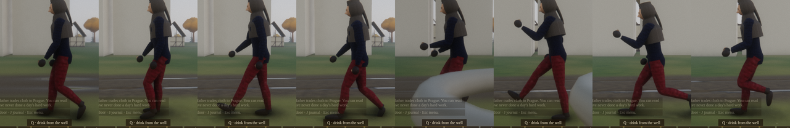
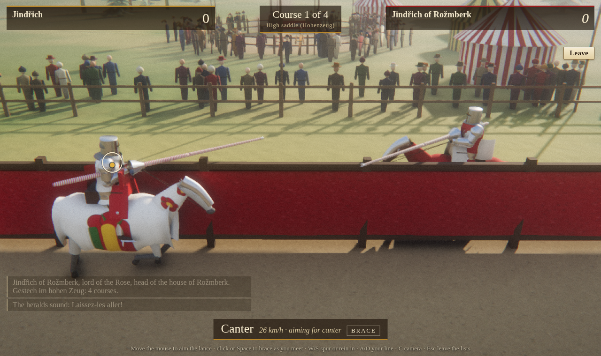
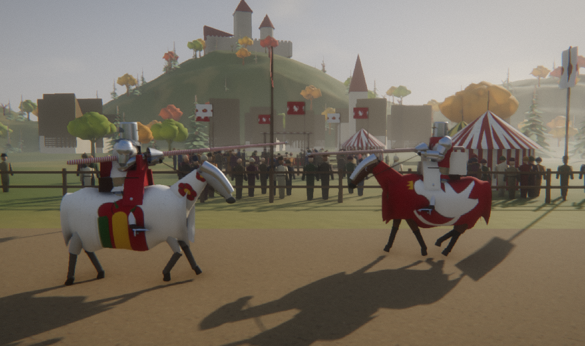
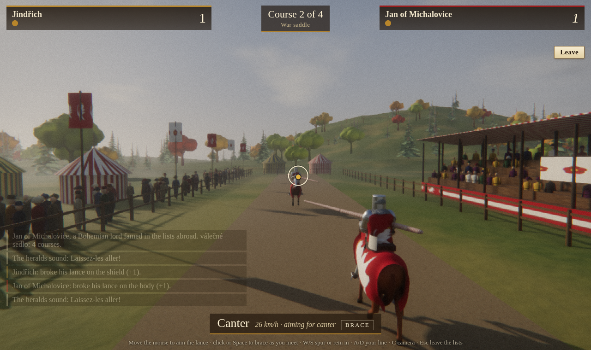
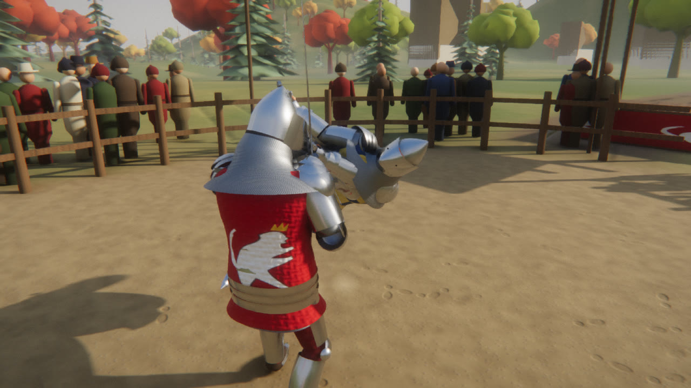
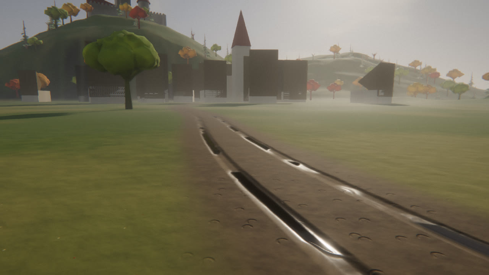

# Zweikampf 1403

A physics-based duel in the lists of Bohemia in 1403: the year King Wenceslas IV
sat captive in Vienna and Sigismund's Hungarian army, with its Cumans, campaigned
through the kingdom. You choose your armour piece by piece from head to foot,
your weapon and your fighting art, and fight one of ten opponents of the period.

| Kampffechten: half-sword against a full harness | Blossfechten: the fencing master's thrusts bounce off plate |
| --- | --- |
|  |  |


## Play

```bash
cd games/duel1403
npm install
npm run dev               # http://127.0.0.1:5174
npm run build:single      # one self-contained page: dist-single/zweikampf-1403.html
npm test                  # physics validation suite
```

| Action | Mouse / keyboard | Touch |
| --- | --- | --- |
| Cut | Drag across the screen in the direction the blade should travel, over the part of him you want to hit | Swipe |
| Thrust | Click the spot you want the point in (face, armpit, palm...) | Tap |
| Parry (Versetzen) | Hold right mouse button or Space | PARRY |
| Blows by key | U I O / J L / M , (the key's place is where the blow comes from), K thrusts | |
| Move | W A S D | Left stick |
| Guards | 1–8, Q / E | guard ◀ ▶ |
| Half-sword / hammer-or-axe / face-or-beak | F | grip |
| Wrestle (shove, throw) | G | wrestle |
| Visor up / down | V | visor |
| Camera (shoulder, barrier, inside your helmet) | C | camera |

## Life in Skalice

**Live in Skalice** on the title screen. You are someone in Skalice, a small
market town under the lord of Skalice castle (the names are invented, the
shape is the period's), from the eve of St Wenceslas, Thursday
27 September 1403. The weekday follows the Julian calendar then in use. The
duel and the joust are things you can do here when you choose.

- **Keys**: WASD walk (Shift to hurry), drag to look, wheel to zoom; E talk
  or go through a door; F eat, Q drink, R relieve yourself, Z sleep, T let
  an hour pass, X drill (soldiers), G steal, V strike, J journal, Esc menu.
- **Who you are**: a lodger (*podruh*), a farmer's second son, a journeyman
  smith, a burgher's son, or a squire (*panoš*). You choose your sex.
  Starting money, clothes, skills and home follow your station.
- **The people**: about 45 people, each drawn with the same detailed body as the duel's fighters (skinned, clothed, with their own skin and hair; men bearded by age and trade, priests shaven). Women have their own build and wear long gowns. Married women cover their hair with a linen veil and wimple, or a knotted kerchief at farm work; girls wear a braid with a band. Wives take their husband's byname in its feminine form (Pekařová, Dlouhá). Beyond 70 m, and until each body is built at start-up, people are instanced figures. Each has a Czech name of the period, ranks
  from `src/data/society.js`, trades, families, homes and workplaces. Each
  has a personality (Big Five plus piety, honesty, temper, greed, courage),
  a mood, a memory of you and an attitude toward you. They follow their
  routines in real time: the baker at his oven from half past two, farmers
  in the fields, wives at the well and market, the sexton ringing the bells,
  the watch walking the streets at night, Mass on Sunday and on the feast.
  The clock runs a game minute per second.
- **Talking, and words that do things**: walk up to anyone and press E. In
  the published game, Claude answers as that person (on the viewer's own
  Claude account; the page asks once). It is given their identity,
  personality, what they own, their memories, what they sell, the date, the
  law, the town's recent news, the rumours of 1403, how you look to them and
  exactly what is in your purse. It answers with speech plus *actions*, and
  the game checks each one against the world and then carries it out:
  - "Here, take two groschen": they **accept** and the money moves from your
    purse to theirs. They can **give** you money or a thing they actually
    have, **sell** to you, or **buy** what you carry.
  - "Come with me" / "I'll pay you a groschen a day": they **follow** you,
    through doors and into buildings, as company or for a daily wage paid
    each morning (unpaid, they walk off). "You can go now" sends them home.
  - "Can I come with you?": they **lead** you to where they are going.
    "Meet me at the tavern": they **go there** and wait.
  - They **teach** you a skill they have (an hour, for a fee or as a favour),
    **hire** you for a day, **enlist** you, point the **way** (an arrow and
    distance appear at the top of the screen), **forgive** a wrong and drop
    the charge, raise the **hue and cry**, or **attack** you.
  Without Claude, a scripted fallback answers in character and understands
  the same kinds of request.
- **Memory and gossip**: everyone keeps memories, each with a weight and a
  source: what they saw, what you did to them or gave them, what you said,
  what they heard and from whom. People standing together pass on what is
  worth telling, weaker with each retelling, and their opinion of you moves
  with it. A theft in the market at nine is known in the tavern by supper,
  and the talk is about who said it.
- **Saving**: the town keeps itself in this browser (every minute and when
  you leave): the clock, your body, purse and record, and everyone's money,
  whereabouts, memories and the last words you exchanged. **Continue** on the
  "Who are you?" screen.
- **Your body**: health, hunger, thirst, bladder, bowels, tiredness and dirt.
  Eat bread, drink at the well or the tavern, use the privy (in the street
  it is an offence if seen), sleep at home, in a bed rented in the tavern
  loft, or in the barracks. The bath-house cleans you.
- **Money and prices**: 12 parvi make a groschen and 60 groschen a kopa. A
  half-pound loaf costs 4 parvi and a labourer earns about 1 groschen a day
  (attested). Other prices are marked as estimates in `src/life/data.js`.
- **The law**: bearing arms in town, the curfew bell, brawling, theft,
  killing (with reconciliation, *smír*, and its stone crosses), the house
  peace, market rules, Sundays and fasts, filth in the street, dice,
  insult, false oaths and breaking banishment. Each is marked attested,
  general or estimate.
- **Crime** (`src/life/Crime.js`): **G** steals from the counter or market
  stall you stand at, or cuts the purse of whoever is next to you (shopkeepers
  watch their goods; the drunk and the busy notice less; your stealth grows
  with practice). **V** strikes someone; the bold fight back (a fight to
  yield), the timid cry out. Unseen, a theft leaves only a suspicion. Seen,
  the victim or a witness raises the **hue and cry** ("Zloděj!"), and every
  able man in earshot gives chase at a run. Outrun them and get out of sight
  and the shouting dies away, but everyone who saw you knows your face.
- **The watch and the court**: small matters are settled on the spot (the
  fine, a night in the gate tower, or a bribe to a greedy watchman). Serious
  ones go before the headman (*rychtář*) and two aldermen (*konšelé*) in the
  rychta, by day; at night you wait in the cellar. For each charge the
  accuser speaks and the court weighs the proof, after the Saxon-Magdeburg
  pattern the Bohemian towns followed:
  - Taken in the act with the goods on you (the "hand-having deed") or two
    sworn witnesses: there is no defence.
  - Otherwise you may **deny on oath**, with **oath-helpers** who swear to
    your good name: two for a small charge, six for a great one ("with seven
    hands"). They are the people who think well of you and did not see you
    do it.
  - You can **confess**, or offer **reconciliation** (*smír*) to the victim or
    the dead man's kin, at a price set by their wealth, temper and grudge.
  - Sentences: fines and amends; restoration twofold and the pillory for
    petty theft; the whip and banishment for a second theft or housebreaking
    by night; the gallows for great theft (over half a kopa) or theft by
    night; the sword for killing, unless reconciled or done in
    self-defence. Before a death sentence you may beg for mercy; friends and
    the priest may intercede. Banished, you are put out on the south road,
    and if the watch finds you in town again you hang.
  The townsfolk break the law too: pilfering at the market, brawls in the
  tavern at night. Their pillory hours and fines are news, and news is gossip.
- **The army**: the captain at the castle takes on men. You serve as foot
  servant (*pacholek*) for a groschen a day, then crossbowman, man-at-arms,
  leader of ten, and squire if you are of knightly birth. You drill in the
  yard, stand watch at the gate and are paid at six in the evening.
  Promotion comes with service and skill.
- **Buildings**: the tavern, the bakery, the smithy, the butcher's, the
  workshops, the bath-house, the rychta, the church and the castle hall and
  barracks have interiors, lit by their fires. Homes are private: going in
  uninvited breaks the house peace.
- **Day and night**: the sun follows the hour at 50° N in late September,
  and the moon lights the night.
- **Walking**: everyone's walk is built from clinical gait data (Perry and
  Burnfield; Winter). Over a stride the hip swings from 30° flexion to 10°
  extension, the knee bends about 15° as the heel takes the weight and about
  60° in swing, and the ankle drops the foot after heel strike, rolls
  forward and pushes off. The pelvis rotates, tilts and drops a few degrees
  each step, the chest turns against it, the arms swing against the legs
  with the elbows a little bent, and the head stays level. Stride length
  comes from each body's own leg lengths, so feet do not skate. People ease
  into and out of a walk, lean into turns, break into a run when they
  hurry, and when standing shift their weight slowly from foot to foot.
  
- Headless check: `node tools/lifetest.mjs 24` (where everyone is, hour by
  hour); `node --test tests/life.test.js` (money changing hands, followers,
  gossip, the hue and cry, the court, saves). Browser playthroughs:
  `node tools/lifeplay.mjs`, `node tools/dev/crimeplay.mjs` (steal bread, be
  seized, stand trial), `node tools/dev/gait.mjs` (side-on walk frames).


## The joust

**The joust** on the title screen. It is a joust of peace (*Gestech*). By
default it is run **with the tilt**, a cloth-hung barrier about 1.8 m high down the
middle, which keeps the horses apart and on their lines and makes it easier.
The tilt is first recorded at Arras in 1429/30, a generation after 1403. Choose
**At large** on the joust screen to ride as it was done in 1403, with no
barrier. The riders pass left side to left side, each lance crossing over its own horse's
neck. You ride against one of four challengers over four courses, with extra
courses on a tie.



| Meeting at large, no tilt (choose "At large") | Second course, the riders' ends swapped |
| --- | --- |
|  |  |

| Action | Mouse / keyboard | Touch |
| --- | --- | --- |
| Aim the lance | Move the mouse: the ring is where you want to strike him, the gold dot is where your lance head will pass now | Drag |
| Brace (lean into the shock) | Left click or Space, just before you meet | BRACE |
| Spur on / rein in (trot, canter, gallop) | W / S | Spur / Rein |
| Ride your line closer / wider | A / D | |
| Camera (behind, through your helm, from the side) | C | |
| Leave the lists | Esc | Leave |

**What is simulated** (`src/joust/`, `src/data/joust.js`):
- **The horse** is a driven 600 kg courser of 15 hands. Its acceleration and
  turning circle depend on gait, and its back rises and pitches through walk,
  trot, canter and gallop. The rider and the lance feel that motion.
- **The rider** is the duel's 13-segment body, held in the saddle by bounded
  seat constraints: the seat, thighs, stirrups and the cantle at the loins.
  The **high saddle** (*Hohenzeug*), used in the Empire from the second half of
  the 14th century, holds him so firmly that unhorsing is almost impossible;
  breaking lances was the point. The **war saddle** holds less. A square blow
  from an ash lance on a man who is not braced can lay him over the cantle.
- **The lance** is 3.8 m of painted fir (or ash) with a vamplate and a
  three-pointed coronel. It lies in the rest on the right breast, so an
  impact goes into the breastplate, not the arm. It breaks at its Euler
  buckling load P = π²EI/(KL)², about 12 kN for a sound 55 mm fir lance and
  less for a knotty one. The bowed lance holds a few milliseconds before it
  snaps, or springs back if the load drops first. A sideways load beyond
  what the wood bends to snaps it at once.
- **The coronel** bites into the wooden ecranche on the left breast and
  skids off plate, so shield hits break lances and helm hits often glance.
- **Scoring**: a broken lance counts 1, on the helm 2, and unhelming adds 2.
  This follows the Order of the Band (Castile, c. 1330), the oldest written
  joust rules. Striking the horse or below the girdle is a foul (−1), after
  Tiptoft's ordinances (1466). Unhorsing ends the joust. No herald's rules
  from Bohemia survive for 1403, and the game says so.
- **The tilt** is in the physics as two half-spaces, one for each side, that
  only the horse and rider on that side touch.
- Headless check: `node tools/jousttest.mjs 8 1` (AI against AI; add `war`,
  `nobrace` or `atlarge`). In the high saddle about 70 % of courses break a lance, at a
  median 10–12 kN and 13 m/s closing speed.

## The realm

**The realm** on the title screen lists the estates of the kingdom in 1403
(`src/data/society.js`). They run from the captive king, the great offices,
the lords (*páni*), knights, squires and *zemané*, through the clergy and the
burghers of the royal towns (burgomaster, aldermen, guild masters,
journeymen, apprentices), to the Jews of Prague, the village (*rychtář,
sedlák, zahradník, chalupník, podruh*) and those outside the estates. Each
estate lists rights, dues, dress and arms, with a precedence number and how
sure the attribution is. The town and its people will be built on this.
`docs/references.md` collects the museum and manuscript references for
modelling armour, swords, horses, people and buildings.

## Debug view

F1 (or `?dev=1`) draws the physics over the scene: colliders by material,
blade trails coloured by speed, commanded hand positions, measure rings and
balance targets. It also shows each fighter's state and an inspector for the
last hit (energy, speed, layers cut through, wound). Keys: P pause,
`.` step one frame, `,` slow motion, B colliders, X x-ray, M measure,
T trails.

## What is historical

**Armour, slot by slot** (`src/data/armour.js`): hood, arming cap, mail coif,
Central European kettle hat, bascinet with aventail (open, with Klappvisier,
with hounskull visor), the brand-new great bascinet, and the already
old-fashioned great helm; mail standard; shirt, arming doublet or a 26-layer
gambeson; haubergeon or long hauberk; coat of plates, brigandine or a globose
breastplate with fauld; jupon with arms; splinted or full plate arms; leather
gloves, mail mittens or hourglass gauntlets; hose, gamboised cuisses, mail
chausses or plate legs; turnshoes or sabatons. Each piece has its date, its
weight (e.g. the Wallace Collection hounskull, 4.07 kg with aventail), the
zones it covers and the gaps it leaves. A full harness comes to about 40 kg.

**Weapons** (`src/data/weapons.js`): long sword (Oakeshott XVa), arming sword,
langes Messer, Hungarian sabre, poleaxe, spear, Bohemian sudlice, war hammer,
flanged mace (palcát), rondel dagger, and the buckler. Each is built from its
parts with real masses, so its balance and inertia come out right. The Hussite
war flail is left out: it belongs to 1420 and later.

**Fighting arts** (`src/data/guards.js`):
- Liechtenauer's four guards (vom Tag, Ochs, Pflug, Alber) and Langort, from
  Hs. 3227a (1389), with the master strikes: Zornhau, Krumphau, Zwerchhau,
  Schielhau, Scheitelhau. Each guard is broken by its strike.
- Fiore dei Liberi's posta (1409): Donna, Finestra, Longa, Breve, Dente di
  Zenghiaro, Tutta and Mezza Porta di Ferro; and his poleaxe and spear guards.
- Kampffechten: the half-sword guards (including Hundfeld's grip under the
  right arm) and the Mordschlag.
- Ms. I.33's seven wards for sword and buckler (c. 1300).
- Lecküchner's messer guards (later than 1403; the game says so).

**Opponents** (`src/data/opponents.js`): invented people, period kit — a Prague
militiaman (Wenceslas Bible), a Cuman horseman in Sigismund's pay, a fencing
priest, a German Messer mercenary, a Bohemian squire, a Hungarian man-at-arms,
a robber knight, a Liechtenauer fencing master, a Friulian condottiere with the
poleaxe, and a German knight in full harness who fights at the half-sword.

Every source is listed in the in-game codex (`src/data/sources.js`).

## The Med Engine

Press **F3** (or add `?stats=1`) for the engine overlay. It now shows the real **GPU time** per frame, measured with timer queries (`EXT_disjoint_timer_query_webgl2`) on the viewer's own graphics card, next to the CPU submit time. Use it to measure performance on real hardware: the numbers in this repository come from a software renderer.

Every pixel is drawn by our own WebGL2 engine, `src/engine/` (three.js is kept
only as the scene graph and maths library; `?engine=three` falls back to its
renderer). Graphics presets: **Ultra / High / Medium / Low** on the title and
pause screens. **F3** (or `?stats=1`) shows live engine statistics.

| The lists | The road to the village: ruts, puddles, hoof prints |
| --- | --- |
|  |  |

**Lighting (physically based, HDR)**
- Deferred shading from a G-buffer (base colour, octahedral normals, roughness,
  metalness, motion vectors, emission) in 16-bit float HDR throughout.
- Cook-Torrance BRDF: GGX distribution, height-correlated Smith visibility,
  Schlick Fresnel, multiple-scattering energy compensation (rough metal keeps
  its brightness). Material types: skin with wrapped subsurface light,
  clear-coated polished steel, cloth sheen (Charlie), thin translucent banners.
- Specular anti-aliasing from normal variance, so polished armour does not
  shimmer at 4K.
- Cascaded shadow maps (4 cascades, texel-snapped, rotated Poisson PCF).
- **A focus shadow map** on top of the cascades: one more layer fitted tightly
  around what matters on screen (the two fighters, the jouster and his horse,
  you and whoever you are talking to). At 2048² over a sphere a few metres
  across a texel is about 1.5 mm, ten times finer than the first cascade, so
  the shadows of a blade, fingers or a hood's edge are sharp where you look.
  This is the idea behind virtual shadow maps (resolution spent where the
  screen needs it) in the form WebGL2 allows.
- **Contact shadows**: a short screen-space ray toward the sun from each pixel,
  thickness-tested against the depth buffer, for what any shadow map is too
  coarse for: a foot on the ground, a hand on a hilt, the fold of a sleeve.
- Image-based light: sky cube, GGX-prefiltered mip chain, SH9 irradiance,
  split-sum BRDF lookup table, and a parallax-corrected reflection probe that
  captures the lists for the armour to reflect.

**Global illumination**
- An irradiance volume of 243 light probes over the lists, each capturing the
  lit scene in six directions and stored as spherical harmonics; captures see
  the previous probes, so light bounces accumulate (red pavilions tint the
  ground beside them, sunlit sand lights the knights from below).
- Screen-space GI: cosine-distributed rays find nearby surfaces and bring their
  light (any colour, from any source, sparks included). They are accumulated
  over time SVGF-style: each pixel counts how many frames its history holds
  (up to 32) and blends in at 1/n, the history is clamped to the
  neighbourhood's mean ± 2σ so it cannot ghost when the light changes, and a
  disocclusion restarts it. The result is cleaned with an edge-aware à-trous
  filter.

**Atmosphere**
- Volumetric height fog, wind-driven ground mist and smoke volumes, raymarched
  through the sun's shadow cascades: light shafts form behind banners, trees
  and knights, and dust kicked up in the fight scatters light. Aerial
  perspective beyond the march distance comes from an analytic fog integral.

**Geometry and data for 4K**
- *Virtual geometry* (after Nanite): the terrain (720k source triangles: a fine
  48 m patch at ~10 cm under the lists and 1.2 km of country) is split into
  128-triangle clusters and simplified level by level with our own quadric
  error simplifier into a cluster DAG, group borders locked so any cut is
  crack-free. Each frame the renderer picks the cut whose error is under a
  pixel, culls clusters by frustum and normal cone, and submits them all with
  one multi-draw call. Built in a worker in a few seconds.
- *Virtual texturing*: the ground is one 131,072² texture (~8 mm per texel)
  streamed as 128-texel pages. A feedback pass records which pages the camera
  needs, read back asynchronously; missing pages are generated on the GPU from
  a procedural material (trodden earth, boot and hoof prints, pebbles, straw,
  autumn grass, cart ruts holding water) into a 4K physical cache with LRU
  eviction, and a mip-chained page table sends each lookup to the best
  resident page.
- *Dynamic LOD*: trees and spectators have detailed models (a spruce is ~3,900
  triangles) with LOD chains made by the same simplifier (down to 76), chosen
  per instance by distance with hysteresis; spatial cells let the camera and
  each shadow cascade cull whole groves; coarse shadow proxies cast the shadows.

**Post-processing**
- Temporal anti-aliasing with upscaling (TAAU): rendering at 77% (High) of
  display resolution with sub-pixel jitter, reconstructed to full resolution
  from history (Catmull-Rom, variance clipping in YCoCg), then robust contrast-
  adaptive sharpening after AMD FSR 1 RCAS. (DLSS needs NVIDIA's tensor-core
  runtime, which a web page cannot use; this is the open alternative.)
- Ground-truth ambient occlusion (horizon-based, after XeGTAO) and
  screen-space reflections (in the puddles, on the steel), filtered over
  time with a neighbourhood-clipped history, faster for mirrors than for
  rough metal.
- **Cloth**: banners and flags are Verlet cloth (stretch, shear and bending
  constraints, pinned at the hoist or the top edge) in a gusting wind, with
  drag along each vertex's normal so they stream and flap.
- Bloom (energy-conserving 13-tap downsample / tent upsample), physical depth
  of field (thin-lens circle of confusion, autofocus on the opponent),
  per-pixel motion blur from the motion vectors, auto exposure, ACES filmic
  tonemapping and grading, plus the game's own lens: visor slits, the blur of
  being stunned, the flash of a hit.

```
src/engine/
  gl/GL.js              programs (uniform introspection), textures, render targets
  Renderer.js           frame graph: shadows, G-buffer, screen-space, lighting, post
  scene/SceneAdapter.js three.js scene -> GPU buffers, skinning, instancing, materials
  shaders/              BRDF, sky, G-buffer, deferred lighting
  passes/               Environment, Shadows, ScreenSpace (GTAO/SSR/SSGI), Volumetrics,
                        Sprites, TAA, Cinematic (DOF, motion blur), Post (exposure,
                        bloom, composite, RCAS), Debug
  gi/ProbeVolume.js     irradiance probes + reflection probe
  geometry/             Simplify (QEM), ClusterDAG, ClusterMesh, LOD, terrain worker
  vt/                   virtual texture, procedural ground material
```

Debug views: `?debug=albedo|normal|rough|metal|motion|ao|ssr|ssgi|depth|emissive|lit`,
`?glcheck=1` reports GL errors per pass.

**What WebGL2 cannot do, and so this engine does not claim.** WebGL2 has no
compute shaders, no indirect or GPU-generated draws, no mesh shaders and no
storage buffers. A fully GPU-driven pipeline (culling and LOD selection on the
GPU writing its own draw lists), true virtual shadow maps (page tables filled by
compute), a visibility buffer (a triangle-ID pass resolved by compute), GPU
particle and cloth simulation, and hardware ray tracing all need WebGPU or a
native API. What is here instead: CPU cluster-DAG culling with one multi-draw
call per mesh, a focus shadow map, CPU Verlet cloth, and deferred shading from a
compact G-buffer. A WebGPU backend is the step that unlocks the rest.

## How it works

```
src/
  physics/   XPBD rigid-body solver (from Forge Boxing), plus contact work and friction impulses
  knight/    anatomy and armour loading, ragdoll, weapons and grips, controller, blows
  game/      fight setup, damage model, AI doctrines, input, HUD, audio
  render/    stages (Forge, three.js fallback), the lists, terrain, foliage, body / armour / weapon meshes
  engine/    the Med Engine (see above)
  world/     the land: one height function for terrain, scenery and physics
  data/      armour, weapons, guards, opponents, sources
```

- **Bodies**: 13 rigid segments with anatomical joint limits and torque-limited
  muscles. Armour adds its mass to the segments it rests on (as a shell, so it
  adds inertia too), which slows armoured limbs.
- **Weapons**: rigid bodies held by one or two grip joints at the hands. A
  bounded internal force between weapon and chest (the coordinated work of arms
  and wrists) drives the weapon along the planned blow; the legs keep balance.
  Half-sword and Mordschlag slide the hands along the blade.
- **Blows**: a cut swings the weapon in a plane through the target with the edge
  (or hammer face, or point for a dagger stab) leading; a thrust drives the point
  along a line. The physics decides how fast it gets there.
- **Damage** (`src/game/Damage.js`): the solver reports the energy each contact
  absorbs and how the weapon arrived (edge, point, flat or blunt head). The
  armour layers at the exact zone hit are applied from the outside in. Plate
  stops cuts and lets a point through only above 40·t^1.7 J; riveted mail stops
  cuts and splits above about 70 J for a narrow point; quilted linen absorbs
  0.43·n^1.89 J of a cut (80 J at 16 layers, 200 J at 26, after Alan Williams)
  and about 60 % of that against a point. What gets through bleeds by zone,
  weakens limbs (a crippled hand drops its weapon) or breaks bones; blunt
  trauma to the head stuns.
- **Endurance**: moving in armour costs more energy (Jaquet et al. 2016: 39.8 kg
  of armour, +66 %; Askew et al. 2012), and a closed visor slows recovery.

### Tools

```bash
node tools/sim.mjs                       # headless smoke test
node tools/blowtest.mjs longsword 2.0    # blow speeds and energies per technique
node tools/falltest.mjs 3 15             # AI duels: does anyone fall over by himself?
npm run dev & node tools/smoke.mjs       # every opponent, armour piece and weapon in the browser
node tools/shot.mjs "?fight=1&foe=knight" shots/k 6,10   # deterministic screenshots
node tools/playtest.mjs fencer           # plays with real mouse drags and clicks
node tools/stress.mjs 60                 # AI tournament: NaNs, explosions, stuck fights, falls
node tools/getuptest.mjs                 # every kit can get up after being thrown
npm test                                 # physics, simplifier and cluster-DAG crack tests
node tools/jousttest.mjs 8 1 [war] [nobrace]   # AI jousts: breaks, forces, unhorsings
node tools/lifetest.mjs 24                # a day in Skalice: everyone's whereabouts, the player's needs
node tools/lifeplay.mjs                   # browser: walk, enter the tavern, talk, buy
node tools/shot.mjs "?joust=1&cam=side" shots/j 7.7   # joust screenshots (cam: chase, helm, side)
```
