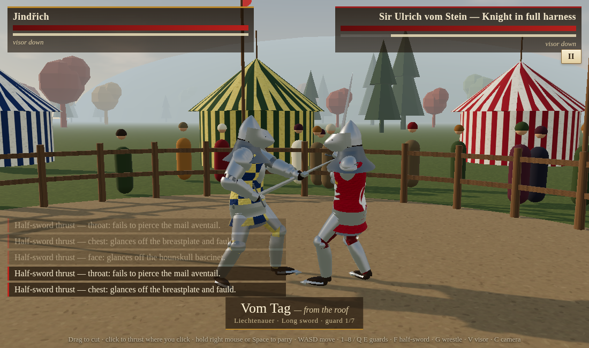
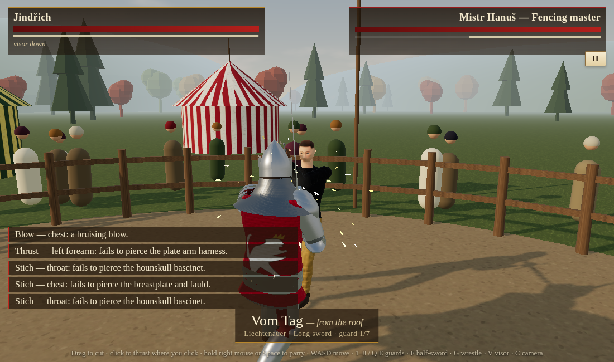
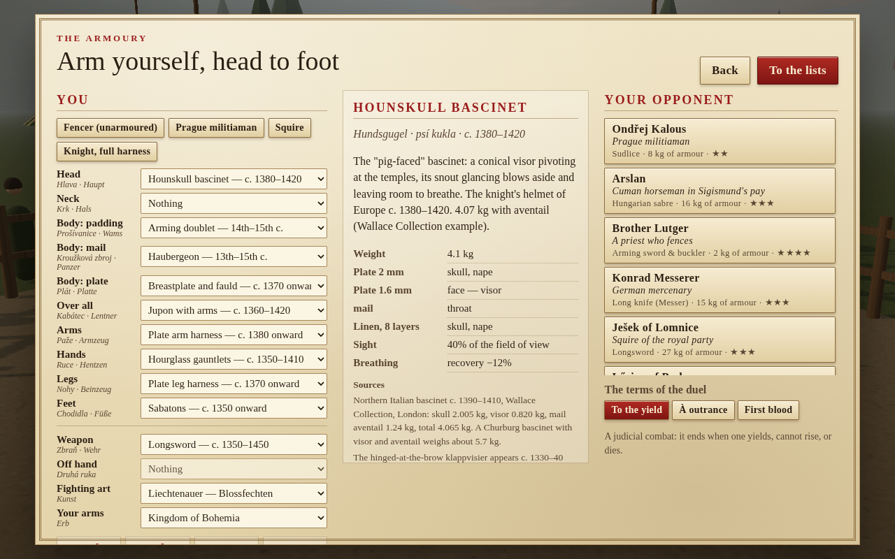

# Zweikampf 1403

A physics-based duel in the lists of Bohemia in 1403: the year King Wenceslas IV
sat captive in Vienna and Sigismund's Hungarian army, with its Cumans, campaigned
through the kingdom. You choose your armour piece by piece from head to foot,
your weapon and your fighting art, and fight one of ten opponents of the period.

| Kampffechten: half-sword against a full harness | Blossfechten: the fencing master's thrusts bounce off plate |
| --- | --- |
|  |  |



## Play

```bash
cd games/duel1403
npm install
npm run dev               # http://127.0.0.1:5174
npm run build:single      # one self-contained page: dist-single/zweikampf-1403.html
npm test                  # physics validation suite
```

| Action | Mouse / keyboard | Touch |
| --- | --- | --- |
| Cut | Drag across the screen in the direction the blade should travel, over the part of him you want to hit | Swipe |
| Thrust | Click the spot you want the point in (face, armpit, palm...) | Tap |
| Parry (Versetzen) | Hold right mouse button or Space | PARRY |
| Blows by key | U I O / J L / M , (the key's place is where the blow comes from), K thrusts | |
| Move | W A S D | Left stick |
| Guards | 1–8, Q / E | guard ◀ ▶ |
| Half-sword / hammer-or-axe / face-or-beak | F | grip |
| Wrestle (shove, throw) | G | wrestle |
| Visor up / down | V | visor |
| Camera (shoulder, barrier, inside your helmet) | C | camera |

## What is historical

**Armour, slot by slot** (`src/data/armour.js`): hood, arming cap, mail coif,
Central European kettle hat, bascinet with aventail (open, with Klappvisier,
with hounskull visor), the brand-new great bascinet, and the already
old-fashioned great helm; mail standard; shirt, arming doublet or a 26-layer
gambeson; haubergeon or long hauberk; coat of plates, brigandine or a globose
breastplate with fauld; jupon with arms; splinted or full plate arms; leather
gloves, mail mittens or hourglass gauntlets; hose, gamboised cuisses, mail
chausses or plate legs; turnshoes or sabatons. Each piece has its date, its
weight (e.g. the Wallace Collection hounskull, 4.07 kg with aventail), the
zones it covers and the gaps it leaves. A full harness comes to about 40 kg.

**Weapons** (`src/data/weapons.js`): long sword (Oakeshott XVa), arming sword,
langes Messer, Hungarian sabre, poleaxe, spear, Bohemian sudlice, war hammer,
flanged mace (palcát), rondel dagger, and the buckler. Each is built from its
parts with real masses, so its balance and inertia come out right. The Hussite
war flail is left out: it belongs to 1420 and later.

**Fighting arts** (`src/data/guards.js`):
- Liechtenauer's four guards (vom Tag, Ochs, Pflug, Alber) and Langort, from
  Hs. 3227a (1389), with the master strikes: Zornhau, Krumphau, Zwerchhau,
  Schielhau, Scheitelhau. Each guard is broken by its strike.
- Fiore dei Liberi's posta (1409): Donna, Finestra, Longa, Breve, Dente di
  Zenghiaro, Tutta and Mezza Porta di Ferro; and his poleaxe and spear guards.
- Kampffechten: the half-sword guards (including Hundfeld's grip under the
  right arm) and the Mordschlag.
- Ms. I.33's seven wards for sword and buckler (c. 1300).
- Lecküchner's messer guards (later than 1403; the game says so).

**Opponents** (`src/data/opponents.js`): invented people, period kit — a Prague
militiaman (Wenceslas Bible), a Cuman horseman in Sigismund's pay, a fencing
priest, a German Messer mercenary, a Bohemian squire, a Hungarian man-at-arms,
a robber knight, a Liechtenauer fencing master, a Friulian condottiere with the
poleaxe, and a German knight in full harness who fights at the half-sword.

Every source is listed in the in-game codex (`src/data/sources.js`).

## How it works

```
src/
  physics/   XPBD rigid-body solver (from Forge Boxing), plus contact work and friction impulses
  knight/    anatomy and armour loading, ragdoll, weapons and grips, controller, blows
  game/      fight setup, damage model, AI doctrines, input, HUD, audio
  render/    stage and sky, the lists, body / armour / weapon meshes, particles, cameras
  data/      armour, weapons, guards, opponents, sources
```

- **Bodies**: 13 rigid segments with anatomical joint limits and torque-limited
  muscles. Armour adds its mass to the segments it rests on (as a shell, so it
  adds inertia too), which slows armoured limbs.
- **Weapons**: rigid bodies held by one or two grip joints at the hands. A
  bounded internal force between weapon and chest (the coordinated work of arms
  and wrists) drives the weapon along the planned blow; the legs keep balance.
  Half-sword and Mordschlag slide the hands along the blade.
- **Blows**: a cut swings the weapon in a plane through the target with the edge
  (or hammer face, or point for a dagger stab) leading; a thrust drives the point
  along a line. The physics decides how fast it gets there.
- **Damage** (`src/game/Damage.js`): the solver reports the energy each contact
  absorbs and how the weapon arrived (edge, point, flat or blunt head). The
  armour layers at the exact zone hit are applied from the outside in. Plate
  stops cuts and lets a point through only above 40·t^1.7 J; riveted mail stops
  cuts and splits above about 70 J for a narrow point; quilted linen absorbs
  0.43·n^1.89 J of a cut (80 J at 16 layers, 200 J at 26, after Alan Williams)
  and about 60 % of that against a point. What gets through bleeds by zone,
  weakens limbs (a crippled hand drops its weapon) or breaks bones; blunt
  trauma to the head stuns.
- **Endurance**: moving in armour costs more energy (Jaquet et al. 2016: 39.8 kg
  of armour, +66 %; Askew et al. 2012), and a closed visor slows recovery.

### Tools

```bash
node tools/sim.mjs                       # headless smoke test
node tools/blowtest.mjs longsword 2.0    # blow speeds and energies per technique
node tools/falltest.mjs 3 15             # AI duels: does anyone fall over by himself?
npm run dev & node tools/smoke.mjs       # every opponent, armour piece and weapon in the browser
node tools/shot.mjs "?fight=1&foe=knight" shots/k 6,10   # deterministic screenshots
node tools/playtest.mjs fencer           # plays with real mouse drags and clicks
```
